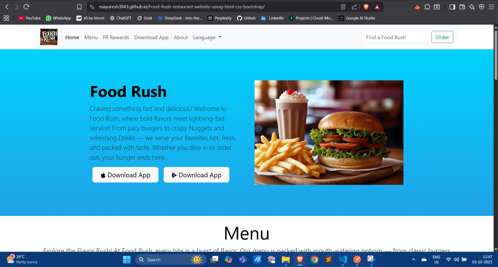
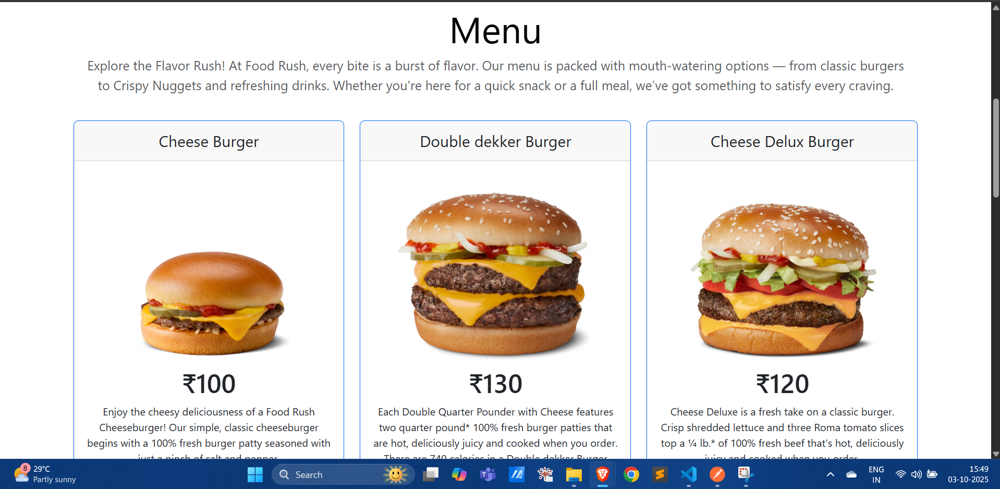
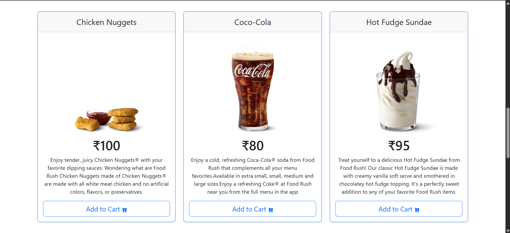
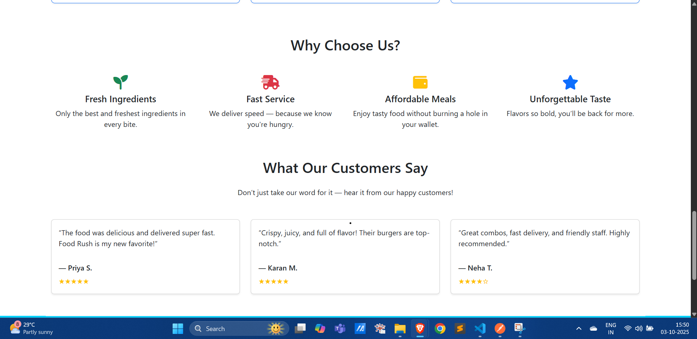

# 🍔 Food Rush – Fast Food Website  

**Food Rush** is a modern fast food restaurant website created using **HTML, CSS, and Bootstrap**.  
The site provides a clean, responsive design with sections for menu items, rewards, contact, and ordering.  

---

## 🛠️ Tech Stack  

<p align="left">
  
  
  
</p>

---

## ✨ Features  

- ✅ Responsive design for desktop and mobile  
- ✅ Attractive navigation bar with call-to-action **Order Now** button  
- ✅ Hero section with promotional banner  
- ✅ Menu section with items and pricing  
- ✅ Rewards, About, and Contact sections  
- ✅ Built entirely with **HTML + Bootstrap**  

---

## 🚀 Getting Started (Run Locally)  

1. Clone the repository  
```bash
   git clone https://github.com/Mayuresh3843/Food-Rush.git
```

2. Navigate to the project folder
```bash
cd Food-Rush
```

3. Open index.html in your browser 🍟

## 📸 Screenshots  

###   
  

###   
  

###   
  

###   
  
